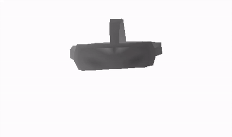

# YawPy
YawPy is a Python 3D graphics engine which provides real-time 3D model outputs based on IMU data. 

The engine consists of three types of complimentary filtering modes:
1. **Dead-Reckoning Mode**: Basic filtering with gyroscope data.
1. **Dead-Reckoning w/ Accellerometer Mode**: Dead-reckoning filter enhanced with accellerometer data.
1. **Dead-Reckoning w/ Accellerometer & Magnetometer Mode**: Dead-reckoning filter enhanced with accellerometer and magnetometer data.

YawPy is an extension of the open source [RenderPy](https://github.com/ecann/RenderPy).
## Installation & Setup
### 1.1 - Downloading YawPy:

Clone the repository by running `git clone https://github.com/lukezsmith/YawPy.git` in terminal or [download the zip](https://github.com/lukezsmith/YawPy/archive/main.zip).

### 1.2 - Installation:
Install dependencies by running `pip3 install -r requirements.txt` in terminal.

### 1.3 - Running YawPy:
YawPy requires the following arguments to be passed to the `render.py` script:
1. IMU Data Path: String
1. Model Data Path: String
1. Filter Mode: Integer (1 = Simple Dead-Reckoning, 2 = Dead-Reckoning w/ accelerometer, 3 = Dead-Reckoning w/ accelerometer & magnetometer)

To run YawPy execute `python3 render.py <data-path> <model-path> <filter-mode>`

## Dependencies
All dependencies are listed in `requirements.txt`